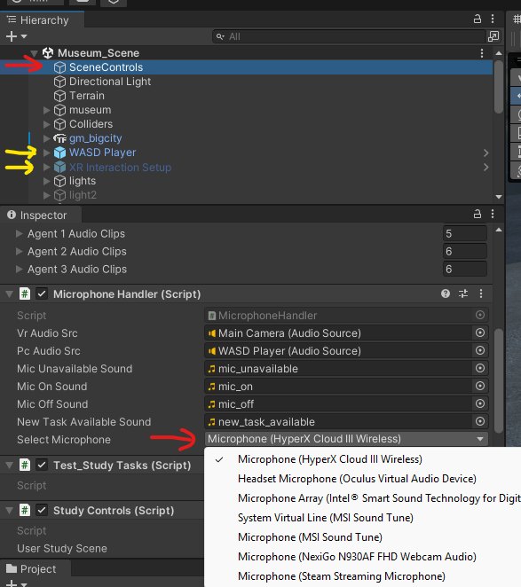

# IVA-Unity

This repository contains the Unity code for the IVA (Interactive Virtual Agent) project.

## User study scenes

* `Assets/Scenes/City_Scene.unity` -> Scenario 1
* `Assets/Scenes/Hotel_Scene.unity` -> Scenario 2
* `Assets/Scenes/Museum_Scene.unity` -> Scenario 3

## How to run the scenes

* Unity version: 2022.3.21
* You need to have the `Python backend` running (IVA-Backend repository) to run the scenes.
* These scenes support VR and Desktop (non-VR) modes. Follow the instruction below to run the scenes in the desired mode.
* In both modes, you need to be pretty close to the agent to interact with it. The agent will not respond if you are too far away, and you will hear a corresponding "broken mic" sound.
* To speak, press the microphone button (see below) start recording, and press it again after you finish speaking. The agent will respond after a short delay.



### Desktop mode

1. Enable `WASD Player` gameobject in hierarchy
2. Disable `XR Interaction Setup` gameobject in hierarchy
3. On the `SceneControls` gameobject, set a working microphone

#### Desktop controls

* M - Toggle microphone
* WASD - Move
* Mouse - Look around
* Space - Jump
* Left Shift - Sprint

### VR mode

1. Enable `XR Interaction Setup` gameobject in hierarchy
2. Disable `WASD Player` gameobject in hierarchy
3. On the `SceneControls` gameobject, set microphone to `Oculus Virtual Audio Device` (or other device equivalent)

#### VR controls

* A - Toggle microphone
* Left Stick - Move
* Right Stick - Look around
* Side Trigger (Grab) - Interact with objects

## OLDER VERSION BELOW


We will show you how to easily modify our files to get this system running for your use case!

1. Clone both repositories.

    ```sh
    git clone https://github.com/maslychm/avatar_llm_api
    ```

    ```sh
    git clone https://github.com/maslychm/avatar_llm_unity
    ```

## In Visual Studio Code

1. Open avatar_llm_api folder in Visual Studio Code.
2. Navigate to "test_all_scenes" folder and duplicate and rename.
3. In transition_prompts.py file change the prompts as needed and make sure to save
4. Navigate to "Terminal" tab at the top left and click "New Terminal"
   
5. Windows with venv

    ```sh
    cd insert_renamed_folder
    ```

    ```sh
    python -m venv venv
    ```

    ```sh
    venv\Scripts\activate
    ```

    ```sh
    pip install edge-tts openai FastAPI[all] ollama
    ```

    ```sh
    uvicorn app:app --reload
    ```

    
    

   Conda (anywhere)

    ```sh
    # Run on WSL and have a running llamafile with its address
    ```

    ```sh
    conda create --name ml
    ```

    ```sh
    conda activate ml
    ```

    ```sh
    pip install edge-tts openai ollama
    ```

    ```sh
    # make sure subprocess command that creates shell has access to above-installed packages
    # Install FastAPI with uvicorn
    pip install FastAPI[all] 
    ```

    ```sh
    uvicorn app:app --reload
    ```

> If you see an error, you are in the wrong directory!
>
## In Unity

1. Open Unity Hub.
2. Click "Add" at the top right.
   
3. Locate and click the avatar_llm_unity folder.
4. Click "Open" (loading the file will take a few seconds).
5. Click the "Edit" tab at the top left of the window, navigate to and click "Project Settings".
    
6. Scroll to and click "Whisper" and disable CUDA by unchecking the "Enable CUDA" box.
    
7. Click the "Projects" tab and navigate to the "Scenes" Folder. Click on the "Prompts test scene" scene and copy, paste, and rename this scene.
    

8. Navigate to the play button at the top and middle of the unity window and you are good to test out the scene!
